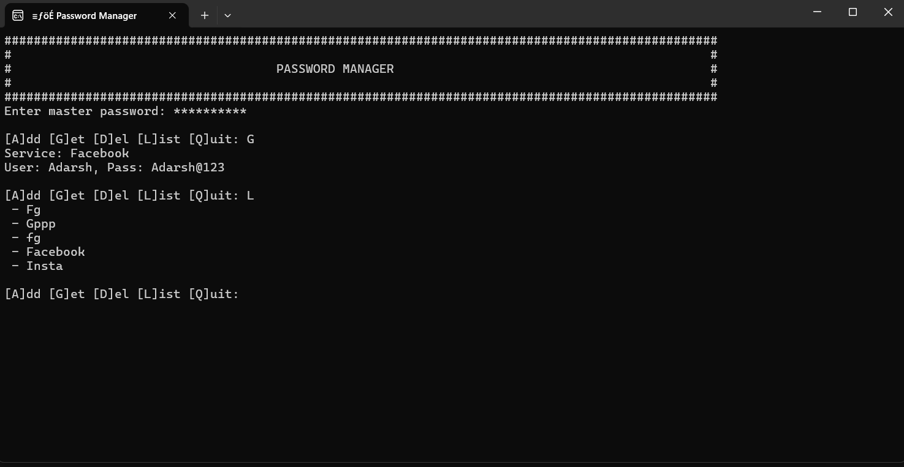

# TermiLock

A terminal-based password manager written in C++ that securely stores and retrieves user credentials using SHA-256 hashing, Base64 encoding, and XOR-based symmetric encryption. It features secure vault access, password generation, and a clean, menu-driven CLI interface.

**GitHub:** [https://github.com/adarshmishra1310/Password-Manager](https://github.com/adarshmishra1310/Password-Manager)

---

## Directory Structure
```
TermiLock/
├── README.md           # this file
├── LICENSE             # MIT License
├── Makefile            # Build script for Unix-like systems
├── src/                # Source files
│   ├── sha256.cpp      # SHA-256 implementation
│   ├── base64.cpp      # Base64 encoding/decoding
│   └── main.cpp        # CLI application logic
├── vault.dat           # Encrypted credential vault
└── master.hash         # Stored SHA-256 hash of the master passkey
```

## Setup

```bash
# Clone the repository
git clone https://github.com/adarshmishra1310/Password-Manager.git
cd Password-Manager

# Build on Windows (MSVC)
cl /EHsc /std:c++17 src\\sha256.cpp src\\base64.cpp src\\main.cpp /Fe:password_manager.exe

# Build on Unix-like systems (using Makefile)
make
```

## Run
```bash
# Windows
password_manager.exe

# Unix-like
./password_manager
```

## 📽️ Demo




# License

MIT License (see [LICENSE](LICENSE))


